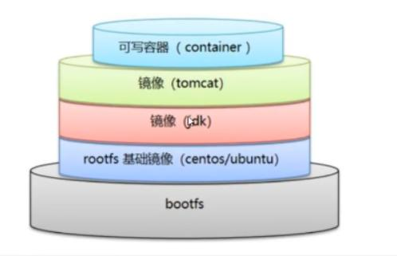
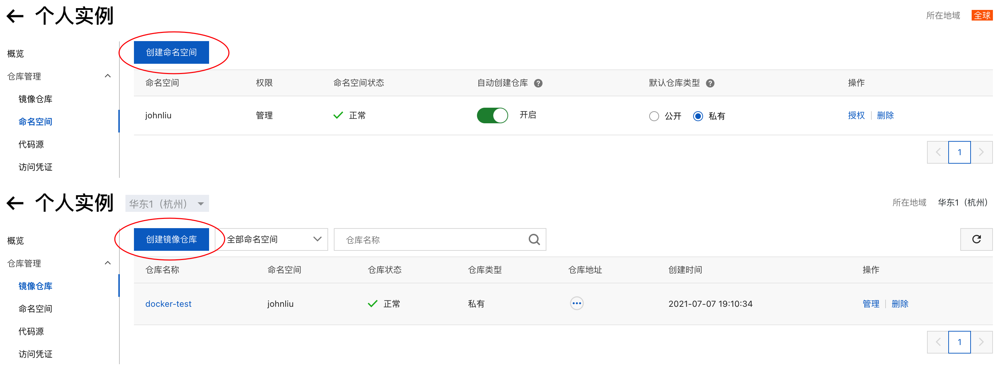
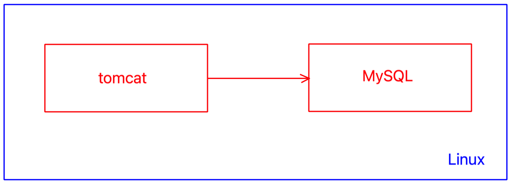
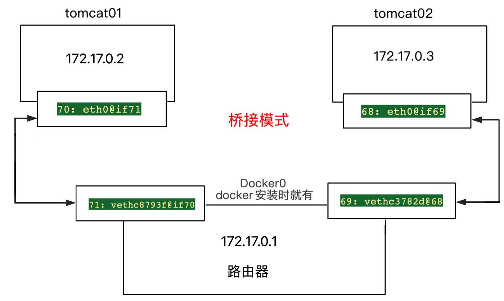
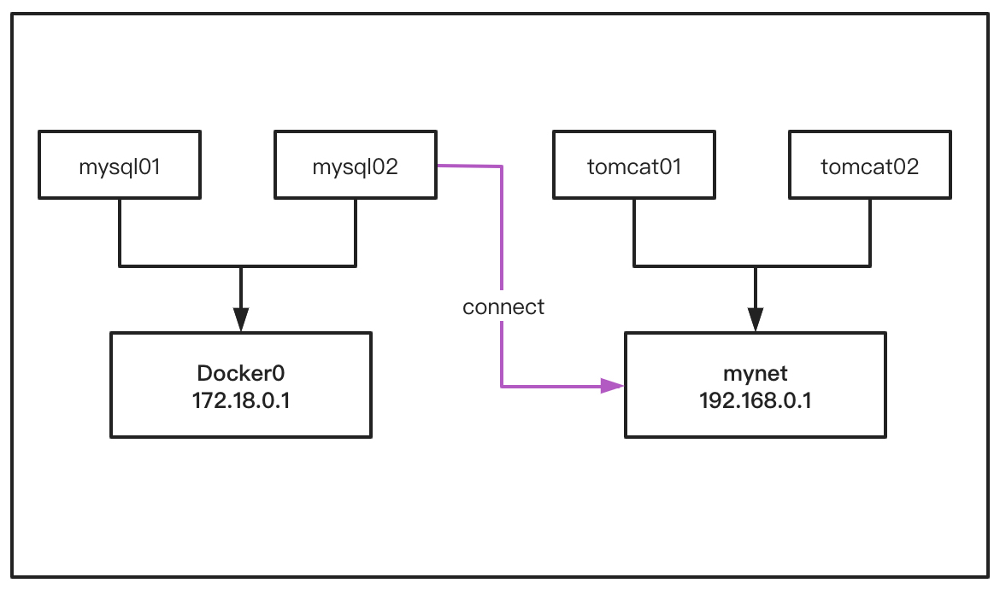
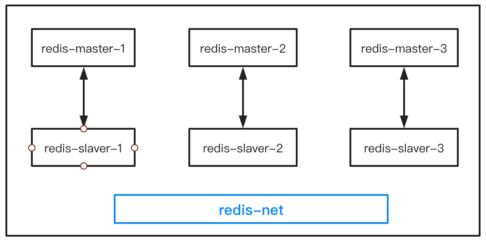

[TOC]

# 1. Docker常用命令

[帮助文档](https://docs.docker.com/reference/)

## 1.1 帮助命令

```shell
docker version
docker info
docker 命令 --help
```


## 1.2 镜像命令

#### docker images

```shell
docker images # 查看所有的镜像

Usage:  docker images [OPTIONS] [REPOSITORY[:TAG]]
List images
Options:
  -a, --all             Show all images (default hides intermediate images)
      --digests         Show digests
  -f, --filter filter   Filter output based on conditions provided
      --format string   Pretty-print images using a Go template
      --no-trunc        Don't truncate output
  -q, --quiet           Only show image IDs # 常用，只显示id
  
  
(base) localhost:~ liuqiang$ docker images
REPOSITORY                  TAG       IMAGE ID       CREATED        SIZE
docker101tutorial           latest    5f9690c80676   4 hours ago    28MB
qzlydao/docker101tutorial   latest    5f9690c80676   4 hours ago    28MB
alpine/git                  latest    b8f176fa3f0d   5 weeks ago    25.1MB
hello-world                 latest    d1165f221234   3 months ago   13.3kB

# 说明
REPOSITORY: 镜像的仓库源
TAG:				镜像的标签
IMAGE ID:   镜像的id
```


#### docker search

```shell
docker search # 搜索镜像

Usage:  docker search [OPTIONS] TERM
Search the Docker Hub for images
Options:
  -f, --filter filter   Filter output based on conditions provided
      --format string   Pretty-print search using a Go template
      --limit int       Max number of search results (default 25)
      --no-trunc        Don't truncate output
      
# 示例
(base) localhost:~ liuqiang$ docker search mysql
NAME                              DESCRIPTION                                     STARS     OFFICIAL   AUTOMATED
mysql                             MySQL is a widely used, open-source relation…   11082     [OK]       
mariadb                           MariaDB Server is a high performing open sou…   4199      [OK]       
mysql/mysql-server                Optimized MySQL Server Docker images. Create…   823                  [OK]

# 示例：加过滤条件
(base) localhost:~ liuqiang$ docker search -f=stars=3000 mysql  # stars不少于3000的mysql镜像
NAME      DESCRIPTION                                     STARS     OFFICIAL   AUTOMATED
mysql     MySQL is a widely used, open-source relation…   11082     [OK]       
mariadb   MariaDB Server is a high performing open sou…   4199      [OK]  
```


#### docker pull

```shell
docker pull # 下载镜像
Usage:  docker pull [OPTIONS] NAME[:TAG|@DIGEST]
Pull an image or a repository from a registry
Options:
  -a, --all-tags                Download all tagged images in the repository
      --disable-content-trust   Skip image verification (default true)
      --platform string         Set platform if server is multi-platform capable
  -q, --quiet                   Suppress verbose output

# 示例1
(base) localhost:~ liuqiang$ docker pull mysql
Using default tag: latest # 默认下载最新tag的镜像
latest: Pulling from library/mysql
b4d181a07f80: Pull complete  # 分层下载，docker images的核心  联合文件系统
...
2f40c47d0626: Pull complete 
Digest: sha256:52b8406e4c32b8cf0557f1b74517e14c5393aff5cf0384eff62d9e81f4985d4b # 签名
Status: Downloaded newer image for mysql:latest
docker.io/library/mysql:latest # 真实地址
# 等价于下面的命令
docker pull docker.io/library/mysql:latest

# 示例2: 指定版本下载
(base) localhost:~ liuqiang$ docker pull mysql:5.7
5.7: Pulling from library/mysql
b4d181a07f80: Already exists 
...
52645b4af634: Pull complete 
...
Digest: sha256:1a2f9cd257e75cc80e9118b303d1648366bc2049101449bf2c8d82b022ea86b7
Status: Downloaded newer image for mysql:5.7
docker.io/library/mysql:5.7
```


#### docker rmi

```shell
docker rmi # 删除镜像
Usage:  docker rmi [OPTIONS] IMAGE [IMAGE...]
Remove one or more images
Options:
  -f, --force      Force removal of the image
      --no-prune   Do not delete untagged parents

# 示例l
(base) localhost:~ liuqiang$ docker rmi -f 09361feeb475
Untagged: mysql:5.7
Untagged: mysql@sha256:1a2f9cd257e75cc80e9118b303d1648366bc2049101449bf2c8d82b022ea86b7
Deleted: sha256:09361feeb4753ac9da80ead4d46e2b21247712c13c9ee3f1e5d55630c64c544f
Deleted: sha256:e454d1e47d2f346e0b2365c612cb6f12476ac4a3568ad5f62d96aa15bccf3e19
Deleted: sha256:e0457c6e331916c8ac6838ef4b22a6f62b21698facf4e143aa4b3863f08cf7d2
Deleted: sha256:ed73046ee2cd915c08ed37a545e1b89da70dc9bafeacfbd9fddff8f967373941
Deleted: sha256:419d7a76abf4ca51b81821da16a6c8ca6b59d02a0f95598a2605a1ed77c012eb

# 示例2：删除全部的镜像
(base) localhost:~ liuqiang$ docker rmi -f $(docker images -aq)
Untagged: docker101tutorial:latest
Untagged: qzlydao/docker101tutorial:latest
Untagged: qzlydao/docker101tutorial@sha256:1455ebbc5db15d1e428f53a2bf227c1e3f919bb0761d9a2cb52d18b9d2830882
Deleted: sha256:5f9690c80676186080319ce67df914461d65beb40bafc3dbd3eff6d0c02cabbd
Untagged: mysql:latest
Untagged: mysql@sha256:52b8406e4c32b8cf0557f1b74517e14c5393aff5cf0384eff62d9e81f4985d4b
Deleted: sha256:5c62e459e087e3bd3d963092b58e50ae2af881076b43c29e38e2b5db253e0287
```


## 1.3 容器命令

**说明：**有了镜像才可以创建容器，以centos为例

```shell
(base) localhost:~ liuqiang$ docker pull centos:8
8: Pulling from library/centos
7a0437f04f83: Pull complete 
Digest: sha256:5528e8b1b1719d34604c87e11dcd1c0a20bedf46e83b5632cdeac91b8c04efc1
Status: Downloaded newer image for centos:8
docker.io/library/centos:8
```

#### 新建容器并启动

```shell
docker run # 运行容器
Usage:  docker run [OPTIONS] IMAGE [COMMAND] [ARG...]

# 常用可选参数说明
--name='Name' 			容器名
-d, --detach  			后台方式运行
-it           			使用交互方式运行，进入容器查看内容
-p, --publish       指定容器的端口
	-p ip:主机端口:容器端口
	-p 主机端口:容器端口 （常用）
	-p 容器端口
	容器端口
-P, --publish-all   随机指定端口

# 示例1: 测试，启动并进入容器
(base) localhost:bin liuqiang$ docker run -it centos:8 /bin/bash
[root@611b6ce7b34f /]# ls
bin  dev  etc  home  lib  lib64  lost+found  media  mnt  opt  proc  root  run  sbin  srv  sys  tmp  usr  var
[root@611b6ce7b34f /]# exit # 推出容器
exit
(base) localhost:bin liuqiang$ 
```


#### 列出运行的容器

```shell
docker ps 查看容器(默认列出正在运行的容器)
Usage:  docker ps [OPTIONS]
List containers
Options:
  -a, --all             列出正在运行 + 历史运行过的容器
  -f, --filter filter   Filter output based on conditions provided
      --format string   Pretty-print containers using a Go template
  -n, --last int        显示最近创建的容器
  -l, --latest          Show the latest created container (includes all states)
      --no-trunc        Don't truncate output
  -q, --quiet           只显示容器id
  -s, --size            Display total file sizes
  
# 示例
(base) localhost:bin liuqiang$ docker ps -aq
611b6ce7b34f
f4dd7b112a37
07a26bc1d470
a4c8cb921390
```

#### 退出容器

```shell
exit # 停止运行并推出容器
Ctrl + P + Q  # 只退出容器

# 示例
(base) localhost:~ liuqiang$ docker ps    # 查看正在运行的容器，为空 
CONTAINER ID   IMAGE     COMMAND   CREATED   STATUS    PORTS     NAMES
(base) localhost:~ liuqiang$ 
(base) localhost:~ liuqiang$ docker run -it centos:8 /bin/bash # 运行并进入容器
[root@486b20928312 /]# (base) localhost:~ liuqiang$            # Ctrl+P+Q退出容器
(base) localhost:~ liuqiang$ docker ps
CONTAINER ID   IMAGE      COMMAND       CREATED          STATUS          PORTS     NAMES
486b20928312   centos:8   "/bin/bash"   33 seconds ago   Up 33 seconds             fervent_nightingale
```

#### 删除容器

```shell
docker rm # 删除容器，默认是无法删除正在运行的容器
Usage:  docker rm [OPTIONS] CONTAINER [CONTAINER...]
Remove one or more containers
Options:
  -f, --force     Force the removal of a running container (uses SIGKILL)
  -l, --link      Remove the specified link
  -v, --volumes   Remove anonymous volumes associated with the container

# 示例1: 删除容器
(base) localhost:~ liuqiang$ docker ps -a
CONTAINER ID   IMAGE          COMMAND                  CREATED          STATUS                        PORTS                               NAMES
486b20928312   centos:8       "/bin/bash"              34 minutes ago   Up 34 minutes                                                     fervent_nightingale
610b866d369f   centos:8       "/bin/bash"              37 minutes ago   Exited (137) 35 minutes ago                                       stupefied_nash
3dfd66cdfffb   centos:8       "/bin/bash"              37 minutes ago   Exited (137) 35 minutes ago                                       nervous_hodgkin
(base) localhost:~ liuqiang$ docker rm 610b866d369f
610b866d369f

# 示例2: 删除所有容器
(base) localhost:~ liuqiang$ docker ps -a
CONTAINER ID   IMAGE          COMMAND                  CREATED             STATUS                           PORTS                               NAMES
486b20928312   centos:8       "/bin/bash"              About an hour ago   Up About an hour                                                     fervent_nightingale
3dfd66cdfffb   centos:8       "/bin/bash"              About an hour ago   Exited (137) About an hour ago                                       nervous_hodgkin
611b6ce7b34f   centos:8       "/bin/bash"              2 hours ago         Exited (0) 2 hours ago                                               vigorous_mccarthy
f4dd7b112a37   d1165f221234   "/hello"                 4 hours ago         Exited (0) 4 hours ago                                               exciting_elion
(base) localhost:~ liuqiang$ docker rm -f $(docker ps -aq) # 删除所有容器
486b20928312
3dfd66cdfffb
611b6ce7b34f
f4dd7b112a37
(base) localhost:~ liuqiang$ docker ps -a
CONTAINER ID   IMAGE     COMMAND   CREATED   STATUS    PORTS     NAMES

# 示例3: 用管道符删除所有容器
(base) localhost:~ liuqiang$ docker ps -a
CONTAINER ID   IMAGE      COMMAND                  CREATED              STATUS                        PORTS     NAMES
ebae6e6d1817   redis      "docker-entrypoint.s…"   About a minute ago   Exited (137) 14 seconds ago             optimistic_tereshkova
493f370d7a15   centos:8   "/bin/bash"              4 minutes ago        Exited (137) 14 seconds ago             jolly_brown
(base) localhost:~ liuqiang$ docker ps -aq|xargs docker rm # 使用管道符删除所有容器
ebae6e6d1817
493f370d7a15
(base) localhost:~ liuqiang$ docker ps -a
CONTAINER ID   IMAGE     COMMAND   CREATED   STATUS    PORTS     NAMES
```

#### 启动和停止容器

```shell
docker start CONTAINER [CONTAINER...]    # 启动容器
docker restart CONTAINER [CONTAINER...]  # 重启容器
docker stop CONTAINER [CONTAINER...]     # 停止当前运行的容器
docker kill CONTAINER [CONTAINER...]		 # 强制停止当前容器
```

## 1.4 其它常用命令

#### 查看日志

```shell
docker logs # 查看日志
Usage:  docker logs [OPTIONS] CONTAINER
Fetch the logs of a container
Options:
      --details        Show extra details provided to logs
  -f, --follow         Follow log output
      --since string   Show logs since timestamp (e.g. 2013-01-02T13:23:37Z) or relative (e.g. 42m for 42 minutes)
  -n, --tail string    Number of lines to show from the end of the logs (default "all")
  -t, --timestamps     Show timestamps
      --until string   Show logs before a timestamp (e.g. 2013-01-02T13:23:37Z) or relative (e.g. 42m for 42 minutes)
      
      
# 示例: 查看redis容器中的日志
(base) localhost:~ liuqiang$ docker logs -f -t -n=100 9df37afd1e37
2021-07-03T12:29:34.313454900Z 1:C 03 Jul 2021 12:29:34.312 # oO0OoO0OoO0Oo Redis is starting oO0OoO0OoO0Oo
2021-07-03T12:29:34.313504900Z 1:C 03 Jul 2021 12:29:34.313 # Redis version=6.2.4, bits=64, commit=00000000, modified=0, pid=1, just started
2021-07-03T12:29:34.313522000Z 1:C 03 Jul 2021 12:29:34.313 # Warning: no config file specified, using the default config. In order to specify a config file use redis-server /path/to/redis.conf
2021-07-03T12:29:34.314016700Z 1:M 03 Jul 2021 12:29:34.313 * monotonic clock: POSIX clock_gettime
2021-07-03T12:29:34.314608200Z 1:M 03 Jul 2021 12:29:34.314 * Running mode=standalone, port=6379.
2021-07-03T12:29:34.314637600Z 1:M 03 Jul 2021 12:29:34.314 # Server initialized
2021-07-03T12:29:34.315137500Z 1:M 03 Jul 2021 12:29:34.314 * Ready to accept connections
```

#### 查看容器中的进程信息

```shell
(base) localhost:~ liuqiang$ docker ps 
CONTAINER ID   IMAGE     COMMAND                  CREATED          STATUS          PORTS      NAMES
9df37afd1e37   redis     "docker-entrypoint.s…"   16 minutes ago   Up 16 minutes   6379/tcp   kind_swirles
(base) localhost:~ liuqiang$ docker top 9df37afd1e37 # 查看容器内的进程信息
UID      PID      PPID       C      STIME      TTY       TIME         CMD
999      4324     4298       0      12:29      ?         00:00:06     redis-server *:6379
```

#### 查看镜像的元数据

```shell
docker inspect # 查看容器中的元数据	
Usage:  docker inspect [OPTIONS] NAME|ID [NAME|ID...]
```

#### 进入当前正在运行的容器

通常容器都是使用后台方式运行的，需要进入容器，修改一些配置。

```shell
# 方式1: docker exec 
docker exec -it 容器ID bashShell
Usage:  docker exec [OPTIONS] CONTAINER COMMAND [ARG...]

# 示例
(base) localhost:~ liuqiang$ docker ps
CONTAINER ID   IMAGE      COMMAND       CREATED          STATUS          PORTS     NAMES
b73cfbf2b3a1   centos:8   "/bin/bash"   23 seconds ago   Up 22 seconds             centos
(base) localhost:~ liuqiang$ docker exec -it b73cfbf2b3a1 /bin/bash 	# 进入当前正在运行的容器 
[root@b73cfbf2b3a1 /]# ls
bin  dev  etc  home  lib  lib64  lost+found  media  mnt  opt  proc  root  run  sbin  srv  sys  tmp  usr  var

# 方式2: docker attach 容器ID
(base) localhost:~ liuqiang$ docker ps
CONTAINER ID   IMAGE      COMMAND       CREATED         STATUS         PORTS     NAMES
b73cfbf2b3a1   centos:8   "/bin/bash"   4 minutes ago   Up 4 minutes             centos
(base) localhost:~ liuqiang$ docker attach b73cfbf2b3a1
[root@b73cfbf2b3a1 /]# ls
bin  dev  etc  home  lib  lib64  lost+found  media  mnt  opt  proc  root  run  sbin  srv  sys  tmp  usr  var


# 区别
# docker exec 	 进入容器后开启一个新的终端，可以在里面操作
# docker attach  进入容器正在执行的终端，不会启动新的进程
```

#### 拷贝容器内文件到主机

```shell
docker cp 容器ID:路径 主机路径

# 示例
[root@b73cfbf2b3a1 /]# ls
bin  dev  etc  home  lib  lib64  lost+found  media  mnt  opt  proc  root  run  sbin  srv  sys  tmp  usr  var
[root@b73cfbf2b3a1 /]# cd home
[root@b73cfbf2b3a1 home]# touch Person.java
[root@b73cfbf2b3a1 home]# ls
Person.java
[root@b73cfbf2b3a1 home]# exit
exit
(base) localhost:~ liuqiang$ docker ps -a
CONTAINER ID   IMAGE      COMMAND       CREATED        STATUS                     PORTS     NAMES
b73cfbf2b3a1   centos:8   "/bin/bash"   12 hours ago   Exited (0) 9 seconds ago             centos
(base) localhost:~ liuqiang$ docker cp b73cfbf2b3a1:/home/Person.java /Users/liuqiang/Desktop
```


#### 示例：安装运行Nginx

```shell
# 1. 搜索Nginx镜像
(base) localhost:~ liuqiang$ docker search nginx
NAME                              DESCRIPTION                                     STARS     OFFICIAL   AUTOMATED
nginx                             Official build of Nginx.                        15105     [OK]       
jwilder/nginx-proxy               Automated Nginx reverse proxy for docker con…   2037                 [OK]
richarvey/nginx-php-fpm           Container running Nginx + PHP-FPM capable of…   816                  [OK]
jc21/nginx-proxy-manager          Docker container for managing Nginx proxy ho…   209                  

# 2. 下载Nginx镜像
(base) localhost:~ liuqiang$ docker pull nginx
Using default tag: latest
latest: Pulling from library/nginx
b4d181a07f80: Already exists 
edb81c9bc1f5: Pull complete 
b21fed559b9f: Pull complete 
03e6a2452751: Pull complete 
b82f7f888feb: Pull complete 
5430e98eba64: Pull complete 
Digest: sha256:47ae43cdfc7064d28800bc42e79a429540c7c80168e8c8952778c0d5af1c09db
Status: Downloaded newer image for nginx:latest
docker.io/library/nginx:latest

# 3. 运行镜像
(base) localhost:~ liuqiang$ docker run -d --name nginx01 -p 8080:80  nginx
cc51d81920fe8aa15e925d4f35c7b22b562193aab591cf54d8ba55b8dacc7fda

# 4. 测试
(base) localhost:~ liuqiang$ curl localhost:8080
<!DOCTYPE html>
<html>
<head>
<title>Welcome to nginx!</title>
<style>
    body {
        width: 35em;
        margin: 0 auto;
        font-family: Tahoma, Verdana, Arial, sans-serif;
    }
</style>
</head>
<body>
<h1>Welcome to nginx!</h1>
<p>If you see this page, the nginx web server is successfully installed and
working. Further configuration is required.</p>

<p>For online documentation and support please refer to
<a href="http://nginx.org/">nginx.org</a>.<br/>
Commercial support is available at
<a href="http://nginx.com/">nginx.com</a>.</p>

<p><em>Thank you for using nginx.</em></p>
</body>
</html>
```


#### 可视化

- portainer

  ```shell
  docker run -d -p 8088:9000 --restart=always --privileged=true portainer/portainer
  ```

- Rancher（CI/CD再用）


# 2. Docker镜像理解

#### 分层思想、联合文件系统

#### commit提交镜像

```shell
docker commit # 提交镜像

Usage:  docker commit [OPTIONS] CONTAINER [REPOSITORY[:TAG]]
Create a new image from a container's changes
Options:
  -a, --author string    Author (e.g., "John Hannibal Smith <hannibal@a-team.com>")
  -c, --change list      Apply Dockerfile instruction to the created image
  -m, --message string   Commit message
  -p, --pause            Pause container during commit (default true)
```


# 3. 容器数据卷

数据卷技术主要是**对容器中的数据进行同和持久化，容器间也是可以数据共享的！**

### 3.1 使用数据卷

#### 直接使用命令来挂载 -v

是==双向同步==

即使停止容器，在宿主机对应的目录操作文件，依然可以同步到容器对应的目录。

```shell
docker run -it -v 主机目录:容器内目录

# 示例
(base) localhost:home liuqiang$ docker run -it -v /Users/liuqiang/docker_data:/home centos:8 /bin/bash

# 查看挂载信息
docker inspect 容器ID
"Mounts": [
            {
                "Type": "bind",
                "Source": "/Users/liuqiang/docker_data",
                "Destination": "/home",
                "Mode": "",
                "RW": true,
                "Propagation": "rprivate"
            }
        ]

```

#### 具名和匿名挂载

```shell
# 匿名挂载
-v 容器内路径
(base) localhost:docker_data liuqiang$ docker run -d -P --name nginx01 -v /etc/nginx nginx

# 查看所有 volume 的情况
(base) localhost:docker_data liuqiang$ docker volume ls
DRIVER    VOLUME NAME
local     1f0ed3b7df5601cbe6b399f15d943b6c98961b6a0bb98ccbe57f5578b87ea4c5
local     68f91da935635e2ad37af2b47f8374b04b56d3e91e475df0879a1c6bc78297b9

# 这里可以看到，volume name是一串随机编码，因为我们在 -v 后只写了容器内的路径，没有写容器外的路径，这就是匿名挂载

# 具名挂载
-v 卷名:容器内路径
(base) localhost:docker_data liuqiang$ docker run -d -P --name nginx02 -v named-nginx:/etc/nginx nginx
a1a74f56f2775bd2d589e8b51a41cb32191d38911242002e5a70187de6e4caac
(base) localhost:docker_data liuqiang$ docker volume ls
DRIVER    VOLUME NAME
local     named-nginx
local     1f0ed3b7df5601cbe6b399f15d943b6c98961b6a0bb98ccbe57f5578b87ea4c5
local     68f91da935635e2ad37af2b47f8374b04b56d3e91e475df0879a1c6bc78297b9

# 查看挂载卷对应的路径
(base) localhost:lib liuqiang$ docker volume ls
DRIVER    VOLUME NAME
local     named-nginx
(base) localhost:lib liuqiang$ docker volume inspect named-nginx
[
    {
        "CreatedAt": "2021-07-06T07:40:34Z",
        "Driver": "local",
        "Labels": null,
        "Mountpoint": "/var/lib/docker/volumes/named-nginx/_data",
        "Name": "named-nginx",
        "Options": null,
        "Scope": "local"
    }
]
```

所有docker容器内的卷，没有指定目录的情况下都是在 /var/lib/docker/volumes/xxx/_data

我们通过具名挂载可以方便的找到我们的卷，大多数情况下使用的是具名挂载

```shell
# 三种挂载形式
-v 容器内路径    					# 匿名挂载
-v 卷名:容器内路径					 # 具名挂载
-v /宿主机路径:容器内路径		 # 指定路径挂载
```

拓展：挂载时指定文件的读写权限

```shell
ro readonly 	# 只读
rw readwrite  # 可读可写

# 示例
docker run -d -P --name nginx02 -v named-nginx:/etc/nginx:ro nginx
docker run -d -P --name nginx02 -v named-nginx:/etc/nginx:rw nginx

# ro 只要看到ro就说明这个路径只能通过宿主机来操作，容器内都是无法操作的！
```


#### DockerFile中挂载数据卷

DockerFile是用来构建docker镜像的构建文件，命令脚本。

通过这个脚本可以生成镜像，镜像时一层一层的，脚本一个个的命令，每个命令都是一层！

```shell
# 1. 创建一个dockerfile文件
# 指令(大写)  参数
FROM centos:8

VOLUME ["/volume01", "/volume02"]

CMD echo "-----end-----"

CMD /bin/bash

# 2. 构建镜像
docker build -f /Users/liuqiang/docker_data/dockerfile01 -t john/centos:1.0 .
[+] Building 0.2s (5/5) FINISHED                                                                                                                                                                          
 => [internal] load build definition from dockerfile01                                                                                                                                               0.0s
 => => transferring dockerfile: 133B                                                                                                                                                                 0.0s
 => [internal] load .dockerignore                                                                                                                                                                    0.0s
 => => transferring context: 2B                                                                                                                                                                      0.0s
 => [internal] load metadata for docker.io/library/centos:8                                                                                                                                          0.0s
 => [1/1] FROM docker.io/library/centos:8                                                                                                                                                            0.0s
 => exporting to image                                                                                                                                                                               0.0s
 => => exporting layers                                                                                                                                                                              0.0s
 => => writing image sha256:f75a47123694e3fee61af33f04b723f3ac04585af7a7141f4a5c313e1bb1a8df                                                                                                         0.0s
 => => naming to docker.io/john/centos:1.0                                                                                                                                                           0.0s
 
 # 3. 查看镜像
(base) localhost:docker_data liuqiang$ docker images
REPOSITORY            TAG       IMAGE ID       CREATED        SIZE
john/centos           1.0       f75a47123694   7 months ago   209MB
centos                8         300e315adb2f   7 months ago   209MB


# 4. 启动自己创建的容器john/centos:1.0
(base) localhost:/ liuqiang$ docker run -it -d --name=john_centos a757f70ea5de /bin/bash
[root@8a1264fdee37 /]# ls -l
total 56
lrwxrwxrwx   1 root root    7 Nov  3  2020 bin -> usr/bin
drwxr-xr-x   5 root root  360 Jul  6 09:13 dev
drwxr-xr-x   1 root root 4096 Jul  6 09:13 etc
drwxr-xr-x   2 root root 4096 Nov  3  2020 home
lrwxrwxrwx   1 root root    7 Nov  3  2020 lib -> usr/lib
lrwxrwxrwx   1 root root    9 Nov  3  2020 lib64 -> usr/lib64
drwx------   2 root root 4096 Dec  4  2020 lost+found
drwxr-xr-x   2 root root 4096 Nov  3  2020 media
drwxr-xr-x   2 root root 4096 Nov  3  2020 mnt
drwxr-xr-x   2 root root 4096 Nov  3  2020 opt
dr-xr-xr-x 204 root root    0 Jul  6 09:13 proc
dr-xr-x---   2 root root 4096 Dec  4  2020 root
drwxr-xr-x  11 root root 4096 Dec  4  2020 run
lrwxrwxrwx   1 root root    8 Nov  3  2020 sbin -> usr/sbin
drwxr-xr-x   2 root root 4096 Nov  3  2020 srv
dr-xr-xr-x  13 root root    0 Jul  6 09:13 sys
drwxrwxrwt   7 root root 4096 Dec  4  2020 tmp
drwxr-xr-x  12 root root 4096 Dec  4  2020 usr
drwxr-xr-x  20 root root 4096 Dec  4  2020 var
drwxr-xr-x   2 root root 4096 Jul  6 09:13 volume01
drwxr-xr-x   2 root root 4096 Jul  6 09:13 volume02

# 5. 在容器volume01中创建一个文件
[root@8a1264fdee37 /]# cd volume01
[root@8a1264fdee37 volume01]# echo 'test dockerfile' >> container.txt
[root@8a1264fdee37 volume01]# ls
container.txt

# 6. 在宿主机对应目录查看是否同步
(base) localhost:var liuqiang$ docker inspect 8a1264fdee37
"Mounts": [
            {
                "Type": "volume",
                "Name": "00088286f44a42adb5d0879d2753f014d66a3ce74be9ee994fac3cf5272e0f36",
                "Source": "/var/lib/docker/volumes/00088286f44a42adb5d0879d2753f014d66a3ce74be9ee994fac3cf5272e0f36/_data",
                "Destination": "/volume01",
                "Driver": "local",
                "Mode": "",
                "RW": true,
                "Propagation": ""
            },
            {
                "Type": "volume",
                "Name": "23dd55ccd307d3e7eb868174f7a400afafeb9bbe1a3b888fc291a16cbc3d51f5",
                "Source": "/var/lib/docker/volumes/23dd55ccd307d3e7eb868174f7a400afafeb9bbe1a3b888fc291a16cbc3d51f5/_data",
                "Destination": "/volume02",
                "Driver": "local",
                "Mode": "",
                "RW": true,
                "Propagation": ""
            }
        ]

```


#### 数据卷容器

两个MySQL之间同步数据


```shell
# 启动三个容器
# 首先启动第一个容器
(base) localhost:~ liuqiang$ docker run -it --name centos01 a757f70ea5de /bin/bash
[root@a35d995fce6d /]# ls
bin  dev  etc  home  lib  lib64  lost+found  media  mnt  opt  proc  root  run  sbin  srv  sys  tmp  usr  var  volume01	volume02

# 启动第二容器，加上 --volumes-from 参数，与centos01 的volume01 volume02数据卷同步
(base) localhost:~ liuqiang$ docker run -it --name centos02 --volumes-from centos01 a757f70ea5de /bin/bash
[root@c8d0d523db8f /]# ls
bin  dev  etc  home  lib  lib64  lost+found  media  mnt  opt  proc  root  run  sbin  srv  sys  tmp  usr  var  volume01	volume02

# 在容器centos01的volume01中创建文件
(base) localhost:~ liuqiang$ docker attach a35d995fce6d
[root@a35d995fce6d /]# ls
bin  dev  etc  home  lib  lib64  lost+found  media  mnt  opt  proc  root  run  sbin  srv  sys  tmp  usr  var  volume01	volume02
[root@a35d995fce6d /]# cd volume01/
[root@a35d995fce6d volume01]# echo 'container01' >> info.txt
[root@a35d995fce6d volume01]# ls
info.txt

# 在容器centos02的volume01中查看是否有对应文件
(base) localhost:~ liuqiang$ docker attach centos02
[root@c8d0d523db8f /]# cd /volume01/
[root@c8d0d523db8f volume01]# ls
info.txt
[root@c8d0d523db8f volume01]# cat info.txt 
container01

# 再创建第3个容器
(base) localhost:~ liuqiang$ docker run -it --name centos03 --volumes-from centos01 a757f70ea5de /bin/bash
[root@05c14f0f33e6 /]cd /volume01
[root@05c14f0f33e6 volume01]# cat info.txt 
container01

# 删除第1个容器centos01，centos02、centos03依然可以访问该文件
# 同时修改centos02中的文件，依然会同步到centos03中
# 说明数据卷容器用的是备份机制
```

# 4. DockerFile

### 4.1 DockerFile介绍

dockerfile是用来构建docker镜像的文件！命令参数脚本！

构建步骤：

1. 编写一个dockerfile文件
2. docker build 构建成为一个镜像
3. docker run 运行镜像
4. docker push 发布镜像（DockerHub、阿里云镜像仓库）


示例：centos的dockerfile

```shell
FROM scratch
ADD centos-8-x86_64.tar.xz /
LABEL \
	org.label-schema.schema-version="1.0" \
  org.label-schema.name="CentOS Base Image"  \
  org.label-schema.vendor="CentOS"  \
  org.label-schema.license="GPLv2"  \
  org.label-schema.build-date="20201204"
CMD ["/bin/bash"]
```


### 4.2 DockerFile构建过程

#### 基础知识

1. 每个保留关键字（指令）都必须是大写字母；
2. 从上到下顺序执行
3. \# 表示注释
4. 每一个指令都是创建提交一个新的镜像层，并提交！



#### DockerFile指令

```shell
FROM					# 基础镜像，一切从这里开始构建
MAINTAINER		# 镜像时谁去维护，姓名+邮箱
RUN						# 镜像构建时需要运行的指令
ADD						# 添加内容，copy文件，自动解压
WORKDIR				# 镜像的工作目录
VOLUME				# 挂载的目录
EXPOSE				# 保留端口配置
CMD						# 指定这个容器启动的时候要运行的命令，只有最后一个会生效，可被替代
ENTRYPOINT		# 指定这个容器启动的时候要运行的命令，可以追加命令
ONBUILD				# 当构建一个被继承 DockerFile 这个时候就会运行 ONBUILD 的指令。触发指令
COPY					# 类似ADD，将我们文件拷贝到镜像中
ENV						# 构建的时候设置环境变量！
```


#### 实战

```shell
# 1. 编写一个自己的dockerfile
FROM centos:8
MAINTAINER johnliu<qzlydao@126.com>

ENV MYPATH /usr/local
WORKDIR $MYPATH

RUN yum -y install vim
RUN yum -y install net-tools

EXPOSE 80

CMD echo $MYPATH
CMD echo "-----END-----"
CMD /bin/bash

# 2. 通过dockerfile构建镜像
# docker build -f dockerfile文件路径 -t 镜像名[:tag] .
docker build -f /Users/liuqiang/docker_data/centos_dockerfile -t mycentos:0.1 .
[+] Building 210.9s (8/8) FINISHED   

# 3. 测试，启动容器，看是否能使用 vim、ifconfig命令
(base) localhost:docker_data liuqiang$ docker run -it --name mycentos mycentos:0.1
[root@6eb4e853052e local]# pwd
/usr/local
[root@6eb4e853052e local]# vim test.txt
[root@6eb4e853052e local]# cat test.txt 
aaaaaaa
[root@6eb4e853052e local]# ifconfig
eth0: flags=4163<UP,BROADCAST,RUNNING,MULTICAST>  mtu 1500
        inet 172.17.0.2  netmask 255.255.0.0  broadcast 172.17.255.255
        ether 02:42:ac:11:00:02  txqueuelen 0  (Ethernet)
        RX packets 9  bytes 726 (726.0 B)
        RX errors 0  dropped 0  overruns 0  frame 0
        TX packets 0  bytes 0 (0.0 B)
        TX errors 0  dropped 0 overruns 0  carrier 0  collisions 0

lo: flags=73<UP,LOOPBACK,RUNNING>  mtu 65536
        inet 127.0.0.1  netmask 255.0.0.0
        loop  txqueuelen 1000  (Local Loopback)
        RX packets 0  bytes 0 (0.0 B)
        RX errors 0  dropped 0  overruns 0  frame 0
        TX packets 0  bytes 0 (0.0 B)
        TX errors 0  dropped 0 overruns 0  carrier 0  collisions 0
        
# 4. 查看本地镜像的历史变更信息 docker history 镜像ID
(base) localhost:docker_data liuqiang$ docker history 6b4b69ac951b
IMAGE          CREATED          CREATED BY                                      SIZE      COMMENT
6b4b69ac951b   21 minutes ago   CMD ["/bin/sh" "-c" "/bin/bash"]                0B        buildkit.dockerfile.v0
<missing>      21 minutes ago   CMD ["/bin/sh" "-c" "echo \"-----END-----\""]   0B        buildkit.dockerfile.v0
<missing>      21 minutes ago   CMD ["/bin/sh" "-c" "echo $MYPATH"]             0B        buildkit.dockerfile.v0
<missing>      21 minutes ago   EXPOSE map[80/tcp:{}]                           0B        buildkit.dockerfile.v0
<missing>      21 minutes ago   RUN /bin/sh -c yum -y install net-tools # bu…   14.4MB    buildkit.dockerfile.v0
<missing>      23 minutes ago   RUN /bin/sh -c yum -y install vim # buildkit    63.4MB    buildkit.dockerfile.v0
<missing>      25 minutes ago   WORKDIR /usr/local                              0B        buildkit.dockerfile.v0
<missing>      25 minutes ago   ENV MYPATH=/usr/local                           0B        buildkit.dockerfile.v0
<missing>      25 minutes ago   MAINTAINER johnliu<qzlydao@126.com>             0B        buildkit.dockerfile.v0
<missing>      7 months ago     /bin/sh -c #(nop)  CMD ["/bin/bash"]            0B        
<missing>      7 months ago     /bin/sh -c #(nop)  LABEL org.label-schema.sc…   0B        
<missing>      7 months ago     /bin/sh -c #(nop) ADD file:bd7a2aed6ede423b7…   209MB    
```

#### CMD与ENTRYPOINT

- CMD 命令，在启动镜像时，无法追加命令
- ENTRYPOINT可以追加命令

### 4.3 实战：Tomcat镜像

1. 准备镜像文件 tomcat、jdk压缩包

   ```shell
   (base) localhost:tomcat liuqiang$ ls -l
   total 397408
   -rw-r--r--@ 1 liuqiang  staff   11849843  7  7 16:13 apache-tomcat-10.0.8.tar.gz
   -rw-r--r--  1 liuqiang  staff  189815615  7  7 16:11 jdk-8u162-linux-x64.tar.gz
   ```

2. 编写 Dockerfile文件，官方命名 <font color=red>Dockerfile</font>，build时会自动寻找这个文件，就不要`-f`指定了。

   ```shell
   FROM centos:8
   MAINTAINER johnliu<qzlydao@126.com>
   
   COPY readme.md /usr/local/readme.md
   
   # add jdk, 自动解压
   ADD jdk-8u162-linux-x64.tar.gz /usr/local/
   ADD apache-tomcat-10.0.8.tar.gz /usr/local/
   
   RUN yum -y install vim
   
   ENV MYPATH /usr/local
   WORKDIR $MYPATH
   
   ENV JAVA_HOME /usr/local/jdk1.8.0_162
   ENV CLASSPATH $JAVA_HOME/lib/dt.jar:$JAVA_HOME/lib/tools.jar
   ENV CATALINA_HOME /usr/local/apache-tomcat-10.0.8
   ENV CATALINA_BASH /usr/local/apache-tomcat-10.0.8
   ENV PATH $PATH:$JAVA_HOME/bin:$CATALINA_HOME/lib:$CATALINA_HOME/bin
   
   EXPOSE 8080
   
   CMD /usr/local/apache-tomcat-10.0.8/bin/startup.sh && tail -F /usr/local/apache-tomcat-10.0.8/bin/logs/catalina.out
   ```

3. 构建镜像（==自动搜索Dockerfile文件==）

   ```shell
   (base) localhost:tomcat liuqiang$ docker build -t diytomcat .
   [+] Building 886.1s (11/11) FINISHED                                                                                                                             
    => [internal] load build definition from Dockerfile                                        0.0s
    => => transferring dockerfile: 37B                                                         0.0s
    => [internal] load .dockerignore                                                           0.0s
    => => transferring context: 2B                                                             0.0s
    => [internal] load metadata for docker.io/library/centos:8                                 0.0s
    => CACHED [1/6] FROM docker.io/library/centos:8                                            0.0s
    => [internal] load build context                                                           0.0s
    => => transferring context: 519B                                                           0.0s
    => [2/6] COPY readme.md /usr/local/readme.md                                               0.0s
    => [3/6] ADD jdk-8u162-linux-x64.tar.gz /usr/local/                                        5.0s
    => [4/6] ADD apache-tomcat-10.0.8.tar.gz /usr/local/                                       0.4s
    => [5/6] RUN yum -y install vim                                                            878.6s
    => [6/6] WORKDIR /usr/local                                                                0.0s 
    => exporting to image                                                                      1.9s 
    => => exporting layers                                                                     1.9s 
    => => writing image sha256:01a8a737c712e37daa8262d44c60a42addaba0993370b834f61652bb09d9a3f6  0.0s 
    => => naming to docker.io/library/diytomcat                                                  0.0s 
   (base) localhost:tomcat liuqiang$ docker images                                                                                                         
   REPOSITORY            TAG       IMAGE ID       CREATED              SIZE
   diytomcat             latest    01a8a737c712   About a minute ago   673MB
   ```

4. 启动容器并挂载数据卷

   ```shell
   (base) localhost:tomcat liuqiang$ docker run -d -p 9090:8080 --name=johntomcat -v /Users/liuqiang/docker_data/tomcat/test:/usr/local/apache-tomcat-10.0.8/webapps/test -v /Users/liuqiang/docker_data/tomcat/logs:/usr/local/apache-tomcat-10.0.8/logs 01a8a737c712
   ```

5. 测试访问

   http://localhost:9090/

6. 发布项目（由于做了卷挂载，因此可以直接在本地发布）

   1. 在test项目文件夹下新建`WEB-INF`及`web.xml`

      ```shell
      # 1. 创建WEB-INF 和 index.jsp
      (base) localhost:test liuqiang$ ls
      WEB-INF   index.jsp
      
      # 2. 在WEB-INF下新建web.xml
      ```

      ```xml
      <?xml version="1.0" encoding="UTF-8"?>
      <web-app version="2.4" 
          xmlns="http://java.sun.com/xml/ns/j2ee" 
          xmlns:xsi="http://www.w3.org/2001/XMLSchema-instance"
          xsi:schemaLocation="http://java.sun.com/xml/ns/j2ee 
              http://java.sun.com/xml/ns/j2ee/web-app_2_4.xsd">
      </web-app>
      ```
      
   2. 在jsp文件中写入内容

      ```jsp
      <%@ page language="java"%>
      <!--导入的Java包-->
      <html>
      <head>
          <title>Hello World!</title>
      </head>
      <body bgcolor="#FFFFFF">
      <%
          String msg="JSP Example";
          out.println("Hello World!");
      %>
      <%=msg%>
      <!--显示变量值-->
      </body>
      </html>
      ```

    3. 页面访问
   
      http://localhost:9090/test


### 4.4 发布镜像

#### 发布到DockerHub

```shell
# 1. 登录DockerHub
(base) localhost:logs liuqiang$ docker login -u qzlydao
Password: 
Login Succeeded

# 2. 给镜像打标签为 YOUR_DOCKERHUB_NAME/firstimage
(base) localhost:logs liuqiang$ docker tag diytomcat qzlydao/diytomcat
(base) localhost:logs liuqiang$ docker images
REPOSITORY            TAG       IMAGE ID       CREATED             SIZE
qzlydao/diytomcat     latest    01a8a737c712   About an hour ago   673MB

# 3. 发布镜像  docker push [OPTIONS] NAME[:TAG]
(base) localhost:logs liuqiang$ docker push qzlydao/diytomcat
Using default tag: latest
The push refers to repository [docker.io/qzlydao/diytomcat]
5f70bf18a086: Pushing  1.024kB
635f29b19729: Pushing [=>                                                 ]  2.221MB/63.38MB
23d018bf06e7: Pushing [=====>                                             ]  1.711MB/15.9MB
9bb1abb74611: Pushing [>                                                  ]  2.167MB/384.6MB
6a77d87980ef: Pushing   2.56kB
2653d992f4ef: Waiting 
```


#### 发布到阿里云



# 5. Docker 网络

### 5.1 理解docker0

> Q：docker是如何处理容器网络访问的？



```shell
# 1. 启动第1个容器tomcat01
(base) localhost:Users liuqiang$ docker run -d -P --name=tomcat01 tomcat

# 查看容器内部网络地址
(base) localhost:Users liuqiang$ docker exec -it 4a30079e6e4f /bin/bash
root@4a30079e6e4f:/usr/local/tomcat# ip addr
1: lo: <LOOPBACK,UP,LOWER_UP> mtu 65536 qdisc noqueue state UNKNOWN group default qlen 1000
    link/loopback 00:00:00:00:00:00 brd 00:00:00:00:00:00
    inet 127.0.0.1/8 scope host lo
       valid_lft forever preferred_lft forever
2: tunl0@NONE: <NOARP> mtu 1480 qdisc noop state DOWN group default qlen 1000
    link/ipip 0.0.0.0 brd 0.0.0.0
3: ip6tnl0@NONE: <NOARP> mtu 1452 qdisc noop state DOWN group default qlen 1000
    link/tunnel6 :: brd ::
68: eth0@if69: <BROADCAST,MULTICAST,UP,LOWER_UP> mtu 1500 qdisc noqueue state UP group default 
    link/ether 02:42:ac:11:00:02 brd ff:ff:ff:ff:ff:ff link-netnsid 0
    inet 172.17.0.2/16 brd 172.17.255.255 scope global eth0
       valid_lft forever preferred_lft forever
       
# 在宿主机直接ping 172.17.0.2
(base) localhost:~ liuqiang$ ping 172.17.0.2
PING 172.17.0.2 (172.17.0.2): 56 data bytes
Request timeout for icmp_seq 0
Request timeout for icmp_seq 1
Request timeout for icmp_seq 2
Request timeout for icmp_seq 3

# 可以看到宿主机可以直接ping通容器内部
```

**原理：**<font color='DarkOrchid'>我们每启动一个docker容器，docker就会给container分配一个ip，我么只要安装了docker，就会有一个网卡docker0。</font>

桥接模式，使用的技术是 evth-pair技术。

`68: eth0@if69`  以及下面的`70: eth0@if71`

```shell
# 2. 启动第2个tomcat
(base) localhost:Users liuqiang$ docker run -d -P --name=tomcat02 tomcat
f713b6ce4658ff9a93139887c2f42dfa970dfcbf430be1b207005bbccefe5bea
(base) localhost:Users liuqiang$ docker exec -it f713b6ce4658ff9a93 /bin/bash
root@f713b6ce4658:/usr/local/tomcat# ip addr
1: lo: <LOOPBACK,UP,LOWER_UP> mtu 65536 qdisc noqueue state UNKNOWN group default qlen 1000
    link/loopback 00:00:00:00:00:00 brd 00:00:00:00:00:00
    inet 127.0.0.1/8 scope host lo
       valid_lft forever preferred_lft forever
2: tunl0@NONE: <NOARP> mtu 1480 qdisc noop state DOWN group default qlen 1000
    link/ipip 0.0.0.0 brd 0.0.0.0
3: ip6tnl0@NONE: <NOARP> mtu 1452 qdisc noop state DOWN group default qlen 1000
    link/tunnel6 :: brd ::
70: eth0@if71: <BROADCAST,MULTICAST,UP,LOWER_UP> mtu 1500 qdisc noqueue state UP group default 
    link/ether 02:42:ac:11:00:03 brd ff:ff:ff:ff:ff:ff link-netnsid 0
    inet 172.17.0.3/16 brd 172.17.255.255 scope global eth0
       valid_lft forever preferred_lft forever
```

```shell
# 我们发现这个容器带来网卡，都是成对出现的
# evth-pair 就是一对的虚拟设备接口，他们都是成对出现的，一端连着协议，一端彼此相连
# 正因为这个特性，evth-pair 充当一个桥梁，连接各种虚拟网络设备
# OpenStac，Docker容器之间的连接，OVS的连接，都是适用 evth-pair技术
```

```shell
# 在容器tomcat01中 ping 容器tomcat02的ip地址，可以ping通
root@4a30079e6e4f:/usr/local/tomcat# ping 172.17.0.3
PING 172.17.0.3 (172.17.0.3) 56(84) bytes of data.
64 bytes from 172.17.0.3: icmp_seq=1 ttl=64 time=0.383 ms
64 bytes from 172.17.0.3: icmp_seq=2 ttl=64 time=0.375 ms
64 bytes from 172.17.0.3: icmp_seq=3 ttl=64 time=0.201 ms
64 bytes from 172.17.0.3: icmp_seq=4 ttl=64 time=0.204 ms
64 bytes from 172.17.0.3: icmp_seq=5 ttl=64 time=0.202 ms

# 容器之间网络是互通的
```

**原理：**tomcat01 和 tomcat02 是公用的一个路由器docker0.

所有的容器不指定网络的情况下，都是docker0路由的，docker会给我们的容器分配一个默认的可用ip.

Docker 中的所有的网络接口都是虚拟的，虚拟的转发效率高！




### 5.2 --link（不建议使用）

直接通过container name进行网络连接！

> 场景：我们编写了一个微服务，database url=ip: ，项目不重启，数据库ip换掉了，我们希望可以处理这个问题，可以用名字来访问容器？

```shell
(base) localhost:Users liuqiang$ docker ps
CONTAINER ID   IMAGE     COMMAND             CREATED             STATUS             PORTS                                         NAMES
f713b6ce4658   tomcat    "catalina.sh run"   About an hour ago   Up About an hour   0.0.0.0:55004->8080/tcp, :::55004->8080/tcp   tomcat02
4a30079e6e4f   tomcat    "catalina.sh run"   12 hours ago        Up 12 hours        0.0.0.0:55003->8080/tcp, :::55003->8080/tcp   tomcat01
(base) localhost:Users liuqiang$ docker exec -it tomcat01 ping tomcat02
ping: tomcat02: Name or service not known

# 发现，在tomcat01中直接ping tomcat02是无法ping通的！

# 在启动第3个容器tomcat03，加上--link 参数
(base) localhost:Users liuqiang$ docker run -d -P --name=tomcat03 --link=tomcat01 tomcat
2a18bebcbd7fe1e0722abd59e5a6b1c74cd7498e0d3d47baaeacf3aed77f5195
# 可以通过容器名直接访问
(base) localhost:Users liuqiang$ docker exec -it tomcat03 ping tomcat01
PING tomcat01 (172.17.0.2) 56(84) bytes of data.
64 bytes from tomcat01 (172.17.0.2): icmp_seq=1 ttl=64 time=2.24 ms
64 bytes from tomcat01 (172.17.0.2): icmp_seq=2 ttl=64 time=0.206 ms
64 bytes from tomcat01 (172.17.0.2): icmp_seq=3 ttl=64 time=0.399 ms
64 bytes from tomcat01 (172.17.0.2): icmp_seq=4 ttl=64 time=0.202 ms
64 bytes from tomcat01 (172.17.0.2): icmp_seq=5 ttl=64 time=0.168 ms

# tomcat01却不能直接通过容器名访问tomcat03
(base) localhost:Users liuqiang$ docker exec -it tomcat01 ping tomcat03
ping: tomcat03: Name or service not known

# 本质: 其实就是在hosts文件中添加映射
(base) localhost:Users liuqiang$ docker exec -it tomcat03 cat /etc/hosts
127.0.0.1	localhost
::1	localhost ip6-localhost ip6-loopback
fe00::0	ip6-localnet
ff00::0	ip6-mcastprefix
ff02::1	ip6-allnodes
ff02::2	ip6-allrouters
172.17.0.2	tomcat01 4a30079e6e4f
172.17.0.4	2a18bebcbd7f
```

**本质：** `--link` 就是我们在hosts配置了一个`172.17.0.2	tomcat01 4a30079e6e4f`

不建议使用`--link`!，也不使用docker0，因为docker0不支持容器名连接访问！而是使用自定义网络！

### 5.3 自定义网络

```shell

# docker network命令
Usage:  docker network COMMAND
Manage networks
Commands:
  connect     Connect a container to a network
  create      Create a network
  disconnect  Disconnect a container from a network
  inspect     Display detailed information on one or more networks
  ls          List networks
  prune       Remove all unused networks
  rm          Remove one or more networks

# 查看docker所有的网络
(base) localhost:Users liuqiang$ docker network ls
NETWORK ID     NAME      DRIVER    SCOPE
8fb6fe30c995   bridge    bridge    local
2888c7e17127   host      host      local
9c318fec32d6   none      null      local
```

**网络模式**

- <font color=red>bridge</font>：桥接 docker （默认，我们自己也使用bridge模式）
- none ：不配置网络
- host ：和宿主机共享网络
- container：容器内网络连通（用的少，局限很大）

```shell
# 启动容器时，我们没有指定网络，默认为bridge，因此下面两种启动命令是等价的
docker run -d -P --name tomcat01 tomcat
docker run -d -P --name tomcat01 --net bridge tomcat

# docker0特点，默认，域名不能访问， --link可以打通连接！

# 自定义一个网络
# --driver bridge
# --subnet 192.168.0.0/16
# --gateway 192.168.0.1
(base) localhost:Users liuqiang$ docker network create --driver bridge --subnet 192.168.0.0/16 --gateway 192.168.0.1 mynet
067980dfd30a41379c0823660a16e1cfe7443a19c4dcb96aaf6c80954d4c7851
(base) localhost:Users liuqiang$ docker network ls
NETWORK ID     NAME      DRIVER    SCOPE
8fb6fe30c995   bridge    bridge    local
2888c7e17127   host      host      local
067980dfd30a   mynet     bridge    local
9c318fec32d6   none      null      local

# 查看自己创建的网络
(base) localhost:Users liuqiang$ docker network inspect mynet
[
    {
        "Name": "mynet",
        "Id": "067980dfd30a41379c0823660a16e1cfe7443a19c4dcb96aaf6c80954d4c7851",
        "Created": "2021-07-08T07:32:36.2520983Z",
        "Scope": "local",
        "Driver": "bridge",
        "EnableIPv6": false,
        "IPAM": {
            "Driver": "default",
            "Options": {},
            "Config": [
                {
                    "Subnet": "192.168.0.0/16",
                    "Gateway": "192.168.0.1"
                }
            ]
        },
        "Internal": false,
        "Attachable": false,
        "Ingress": false,
        "ConfigFrom": {
            "Network": ""
        },
        "ConfigOnly": false,
        "Containers": {},
        "Options": {},
        "Labels": {}
    }
]

# 创建tomcat-mynet-01, tomcat-mynet-02两个容器，使用自定义网络
(base) localhost:Users liuqiang$ docker run -d -P --name=tomcat-mynet-01 --network=mynet tomcat
1105f408cd45d8fc84ac12a453050f2ff15070a63d7fdf9939c2240894c662be
(base) localhost:Users liuqiang$ docker run -d -P --name=tomcat-mynet-02 --network=mynet tomcat
83ab745bd638336e6354de180b32aec0fb6b598c08d0e7da7dd9141a06142675
```

```json
// 查看自定义网络mynet
// 可见分别给两个容器分配了ip地址
(base) localhost:Users liuqiang$ docker network inspect mynet
[
    {
        "Name": "mynet",
        "Id": "067980dfd30a41379c0823660a16e1cfe7443a19c4dcb96aaf6c80954d4c7851",
        "Created": "2021-07-08T07:32:36.2520983Z",
        "Scope": "local",
        "Driver": "bridge",
        "EnableIPv6": false,
        "IPAM": {
            "Driver": "default",
            "Options": {},
            "Config": [
                {
                    "Subnet": "192.168.0.0/16",
                    "Gateway": "192.168.0.1"
                }
            ]
        },
        "Internal": false,
        "Attachable": false,
        "Ingress": false,
        "ConfigFrom": {
            "Network": ""
        },
        "ConfigOnly": false,
        "Containers": {
            "1105f408cd45d8fc84ac12a453050f2ff15070a63d7fdf9939c2240894c662be": {
                "Name": "tomcat-mynet-01",
                "EndpointID": "2ee43c852f8ff6e262542ccb4e8153b232ab3bc8fdd4e0c116291eb643b476b2",
                "MacAddress": "02:42:c0:a8:00:02",
                "IPv4Address": "192.168.0.2/16",
                "IPv6Address": ""
            },
            "83ab745bd638336e6354de180b32aec0fb6b598c08d0e7da7dd9141a06142675": {
                "Name": "tomcat-mynet-02",
                "EndpointID": "6f94a4b3570cfdff20b4d2007bd15beee88c351b78844cadb02cccd20096a4e9",
                "MacAddress": "02:42:c0:a8:00:03",
                "IPv4Address": "192.168.0.3/16",
                "IPv6Address": ""
            }
        },
        "Options": {},
        "Labels": {}
    }
]
```

```shell
# 再次测试ping命令，直接ping ip地址
(base) localhost:Users liuqiang$ docker exec -it tomcat-mynet-01 ping 192.168.0.3
PING 192.168.0.3 (192.168.0.3) 56(84) bytes of data.
64 bytes from 192.168.0.3: icmp_seq=1 ttl=64 time=0.221 ms
64 bytes from 192.168.0.3: icmp_seq=2 ttl=64 time=0.386 ms
64 bytes from 192.168.0.3: icmp_seq=3 ttl=64 time=0.360 ms

# 直接ping容器名，也是ok的
(base) localhost:Users liuqiang$ docker exec -it tomcat-mynet-01 ping tomcat-mynet-02
PING tomcat-mynet-02 (192.168.0.3) 56(84) bytes of data.
64 bytes from tomcat-mynet-02.mynet (192.168.0.3): icmp_seq=1 ttl=64 time=0.172 ms
64 bytes from tomcat-mynet-02.mynet (192.168.0.3): icmp_seq=2 ttl=64 time=0.210 ms
```

我们自定义的网络docker都已经帮我们维护好了对应的关系，推荐我们平时这样使用网络

**好处：**<font color='DarkOrchid'>不同的集群使用不同的网络，保证集群是安全和健康的。</font>


### 5.4 网络连通



```shell
# 将一个容器与网卡连通
docker network connect [OPTIONS] NETWORK CONTAINER
Connect a container to a network
Options:
      --alias strings           Add network-scoped alias for the container
      --driver-opt strings      driver options for the network
      --ip string               IPv4 address (e.g., 172.30.100.104)
      --ip6 string              IPv6 address (e.g., 2001:db8::33)
      --link list               Add link to another container
      --link-local-ip strings   Add a link-local address for the container
```


```shell
# 将一个容器连到一个网络
Usage:  docker network connect [OPTIONS] NETWORK CONTAINER
Connect a container to a network
Options:
      --alias strings           Add network-scoped alias for the container
      --driver-opt strings      driver options for the network
      --ip string               IPv4 address (e.g., 172.30.100.104)
      --ip6 string              IPv6 address (e.g., 2001:db8::33)
      --link list               Add link to another container
      --link-local-ip strings   Add a link-local address for the container
      
# 使用默认网络（bridge）启动一个容器tomcat01
(base) localhost:Users liuqiang$ docker run -d -P --name=tomcat01 tomcat

# tomcat01是无法直接连接tomcat-mynet-01的
(base) localhost:Users liuqiang$ docker exec -it tomcat01 ping tomcat-mynet-01
ping: tomcat-mynet-01: Name or service not known

(base) localhost:Users liuqiang$ docker exec -it tomcat01 ping 192.168.0.2
PING 192.168.0.2 (192.168.0.2) 56(84) bytes of data.
--- 192.168.0.2 ping statistics ---
26 packets transmitted, 0 received, 100% packet loss, time 633ms

# 将容器tomcat01与mynet连接
(base) localhost:Users liuqiang$ docker network connect mynet tomcat01

# 测试，可以ping通
(base) localhost:Users liuqiang$ docker exec -it tomcat01 ping tomcat-mynet-01
PING tomcat-mynet-01 (192.168.0.2) 56(84) bytes of data.
64 bytes from tomcat-mynet-01.mynet (192.168.0.2): icmp_seq=1 ttl=64 time=0.142 ms
64 bytes from tomcat-mynet-01.mynet (192.168.0.2): icmp_seq=2 ttl=64 time=0.210 ms
64 bytes from tomcat-mynet-01.mynet (192.168.0.2): icmp_seq=3 ttl=64 time=0.213 ms
```

> 原理：一个容器有两个ip地址。类似阿里云服务，一个公网ip，一个私网ip.


### 5.5 实战：Redis集群部署




# 6. SpringBoot微服务打包Docker镜像

1. 构建SpringBoot项目
2. 打包应用
3. 编写Dockerfile
4. 构建镜像
5. 发布运行
